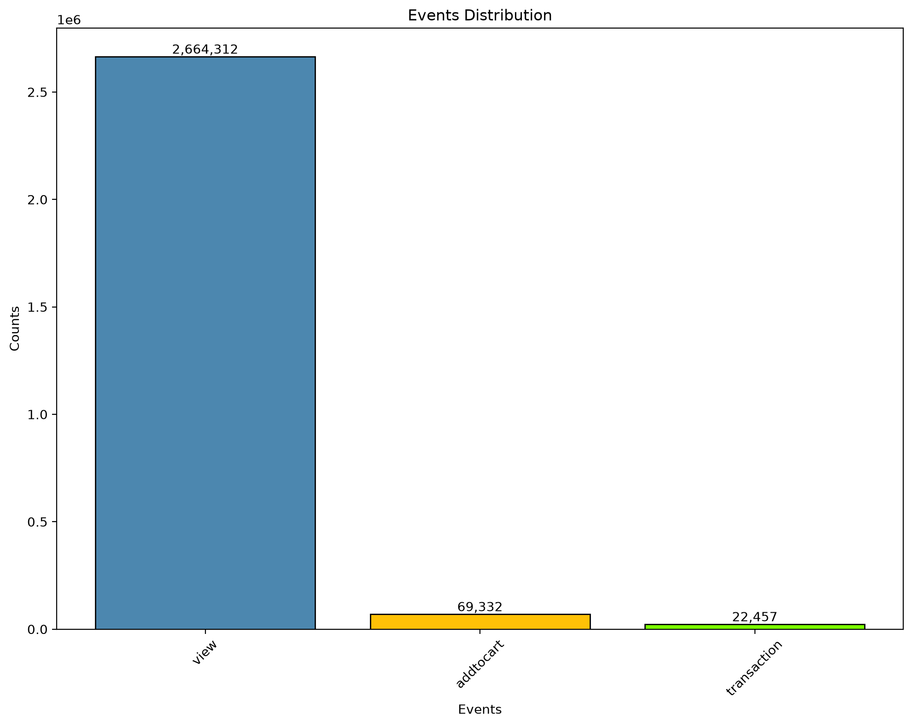
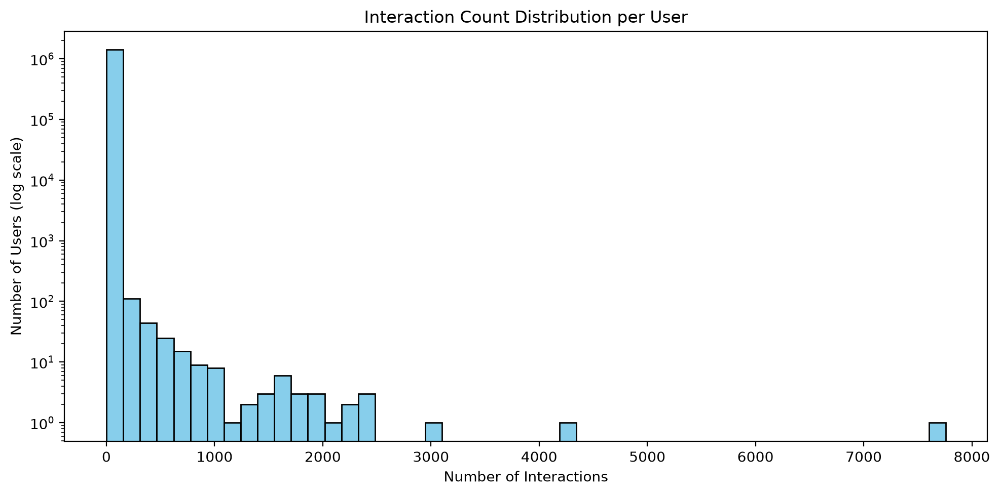

# Retail Recommender System

Implicit-feedback product recommender system on the RetailRocket e-commerce dataset

 I made this project to test my knowledge on Andrew NG ML Specialization

## Problem

E-commerce platforms need to surface relevant products to users despite sparse, noisy implicit feedback (views, cart-adds, purchases) and large product catalogs. This project builds and evaluates recommender model on the RetailRocket dataset to predict which items a user is likely to interact with next.

## Dataset
Source: [Retailrocket recommender system dataset](https://www.kaggle.com/datasets/retailrocket/ecommerce-dataset?select=category_tree.csv)

In order to download easly in code, you can use:
```text
import kagglehub

# Download latest version
path = kagglehub.dataset_download("retailrocket/ecommerce-dataset")

print("Path to dataset files:", path)
```

## Approach

1. **Preprocessing** — time-based train/test split, interaction-count filtering (train-only, to avoid leakage), label encoding of users/items, weighted implicit feedback (view/addtocart/transaction).
2. **Matrix construction** — built sparse user-item interaction matrices from the encoded, filtered data.
3. **Model training** — trained `implicit`'s Alternating Least Squares (ALS) on the interaction matrix, with BM25 reweighting applied to correct for popularity/activity imbalance.
4. **Evaluation & tuning** — grid-searched hyperparameters (factors, regularization, iterations) on a held-out validation set, then evaluated the final model on an untouched test set using Precision@10, NDCG@10, MAP@10, and AUC@10.

## Results

### Event Frquency


### User Interaction Distribution


### Best Model: ALS + BM25

**Best parameters** (from grid search on validation set):
- Factors: 256
- Regularization: 0.5
- Iterations: 15

**Test set metrics:**

| Metric | Score |
|---|---|
| Precision@10 | 0.0323 |
| NDCG@10 | 0.0207 |
| MAP@10 | 0.0151 |
| AUC@10 | 0.5163 |

## Project Structure
```text
├── data/
│   ├── raw/         # (Gitignored) events.csv, item_properties, category_tree
│   └── processed/   # (Gitignored) train/test interaction matrices
├── models/          # (Gitignored) Trained ALS/GRU4Rec model files
├── notebooks/
│   ├── 01_eda.ipynb
│   ├── 02_preprocessing.ipynb
│   └── 03_modeling_als.ipynb
├── results/
├── README.md
├── .gitignore
└── requirements.txt
```

## Setup instruction
1. Download dataset i referenced above
2. Unzip and add it to data/ folder
3. Open new terminal inside project (can be done with 'Ctrl' + 'Shift' + '`')
4. Write 'pip install -r requirements.txt'

## Progress Log
 
| Date | Commit |
|------|--------|
| 14 July | Initializing the Project |
| 15 July | Finished 01 EDA |
| 15 July | Finished 02 Preprocessing |
| 17 July | Finished the Model and Evaluation |
| 17 July | Finalizing Project by lastly finishing README and requirements.txt |

## Link to other repositories i have
- [My Student Pass/Fail ML Project](https://github.com/BadalovSanan/My-StudentPassFail-ML-Project)
- [Casting Product's Deffect Detecting](https://github.com/BadalovSanan/casting-defect-logistic-regression)
- [Concrete Strength Linear Regression](https://github.com/BadalovSanan/concrete-strength-linear-regression)
- [Credit Card Customer Segmentation](https://github.com/BadalovSanan/credit-card-customer-segmentation)
- [Network Intrusion Detection with Random Forest & XGBoost](https://github.com/BadalovSanan/Network-Intrusion-Detection-with-Random-Forest-and-XGBoost)
- [Predictive Maintenance Anomaly Detection Project](https://github.com/BadalovSanan/Predictive-Maintenance-Anomaly-Detection)